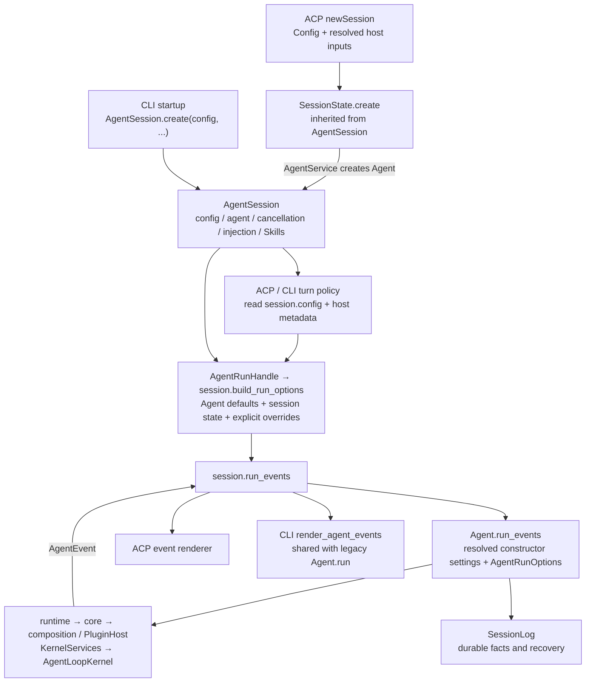

# Agent Session

`box_agent.agent_session.AgentSession` owns live Agent session state and its
`Config` independently of ACP and CLI. ACP's `SessionState` extends it with host
metadata. Existing field access such as `state.agent`, `state.inject_queue`,
and `state.run_handle` uses the same underlying objects.

## Configuration and execution flow



`AgentSession.create(config=..., ...)` requires the existing `Config` and uses
the same constructor settings that ACP and CLI previously passed directly to
`AgentService.create_agent`. The existing Agent, runtime, and kernel contracts
remain unchanged. The kernel receives resolved values and capabilities through
those contracts; it does not receive a raw application Config or ACP state.

| Input | Resolution and propagation |
| --- | --- |
| Step, parallelism, timeout, provider-stale, retry, deduplication, memory-promotion settings | `config.agent` → Agent constructor → existing runtime arguments |
| Tool call and delegation limits | `config.tool_limits` → Agent → default run options |
| Workspace and context budget | Explicit host-resolved overrides win; otherwise use `config.agent.workspace_dir` and `config.llm.context_token_limit` |
| Deferred MCP exposure | Existing conjunction of MCP enabled, deferred loading enabled, and non-utility session |
| Cancellation and injection | Session callback and queue → run options → existing loop |
| Summary client and memory extractor | Session references → run options; explicit host options still win |
| Configured hooks | Host hook loader → session factory → Agent defaults → run options |
| Goal autopilot, research search budget, memory proposal thresholds | Existing adapter policy reads the session's Config |
| Model binding between turns | Host model capabilities win; missing capabilities fall back to the session's Config |

Config is retained by reference. No new copy, reload, environment lookup, or
serialization is introduced. Constructor settings are resolved when the Agent
is created; existing turn-time policy continues to read Config at turn time.
Mutating a shared Config therefore still affects its live readers. Replacing
the adapter's default Config affects future sessions, while existing sessions
retain their original reference. This is not a general configuration hot-reload
API.

## State ownership

| Owner | State |
| --- | --- |
| AgentSession | Agent/config, model clients, cancellation/injection, turn flags and errors, memory, permissions, output context, Skill runtime/selection/preload state, plan approval state, MCP fallback references |
| ACP SessionState | ACP session mode and LLM binding metadata, trace writer, injection request deduplication, expert metadata, upstream session/task/title identifiers, task-registry errors, follow-up suggestion task |
| Agent | Message history and its existing tools, goal, resolved execution settings, SessionLog reference |
| SessionLog | Durable messages, tool calls/results, goal/plan/todo facts, active Skills, and turn boundaries |

Inheritance keeps ACP's current keyword-based construction and attribute
access without duplicate state or a second copy of configuration. For existing
callers that wrap a prebuilt Agent, `SessionState(agent=...)` and
`AgentSession(agent=...)` remain supported. ACP binds its default Config on the
first use of an unconfigured legacy state; it does not rebuild that Agent.
New session creation should always use `create(config=...)`.

`AgentRunHandle` remains a lightweight view over the session. It delegates
option construction to the session, while retaining the existing Agent-default
fallback for callers wrapping a legacy state object.

## Independent use

Callers prepare the provider and tools through their existing capability setup,
then create the session:

```python
from contextlib import aclosing

from box_agent.agent_session import AgentSession

session = AgentSession.create(
    config=config,
    llm_client=llm,
    system_prompt=system_prompt,
    tools=tools,
)
session.agent.add_user_message(user_text)
options = session.build_run_options(logger=None)

async with aclosing(session.run_events(options=options)) as events:
    async for event in events:
        await render(event)
```

Call `session.request_cancel()` to request cancellation. The existing
`session.run_handle.cancelled` property remains supported. Queue
injections on `session.inject_queue` using the existing injection format.
When consuming only part of the stream, close it with `aclosing` or `aclose`;
the wrapper then closes the Agent stream so its normal cleanup and interrupted
turn persistence run. SessionLog remains owned and closed by its existing
caller.

`run_events` marks the session active while its stream is open, records the
completed stop reason, and restores the prior active state in `finally`. ACP
can maintain a wider prompt scope across multiple goal continuations; an
individual run does not end that scope. ACP explicitly closes its outer event
stream before returning a protocol response. CLI's shared renderer closes the
stream on completion, consumer errors, and cancellation.

## ACP and CLI integration

ACP creates `SessionState` through the shared factory and obtains the summary
client, cancellation callback, injection queue, and memory extractor from the
session option builder. Its cancel notification calls `request_cancel()`.
Protocol metadata, permission reverse RPC, and event rendering stay in ACP.

CLI creates one `AgentSession` per invocation. Single tasks, goal continuations,
and interactive turns all use `_run_session_turn` → `build_run_options` →
`run_events`. CLI's Skill selector, preload names/hashes, source text, scratch
directory, force-plan flag, and cancellation state belong to that session.
`/clear` and `/clear_all` retain their existing history and sandbox behavior;
they reuse the same session and reset its source binding.

Esc requests cooperative cancellation on the session. Cancellation is reset
for the next interactive turn, and the previous run task is settled before
closing its trace or showing the next prompt. Terminal rendering, memory
proposal interaction, final text, stop reason, and JSON summary behavior use
the same event consumer as legacy `Agent.run()`.

This extraction does not move ACP's complete prompt pipeline into the session.
Host tool preparation, model binding, task registration, Skill activation,
goal-autopilot orchestration, permission negotiation, and event rendering still
run at their existing boundaries. Standalone callers supply any required
host integration through `build_run_options(**overrides)`. No plugin discovery
or lifecycle changes are part of this migration.

## Regression coverage

`tests/test_agent_session.py` exercises the actual loop with different Config
step limits, standalone cancellation, isolated mutable state, ACP session
configuration retention, model-switch context budgets, interrupted stream
cleanup, and legacy ACP state construction. Existing ACP, Agent, runtime,
kernel, plugin, CLI, and persistence tests cover the unchanged downstream
contracts. `tests/test_architecture_boundaries.py` prevents the session module
from importing application adapters.

`tests/test_cli_session_trace.py` additionally exercises single-task and
interactive session reuse, cancellation followed by a successful next turn,
configured hooks, goal continuations, and unchanged trace/error semantics.
