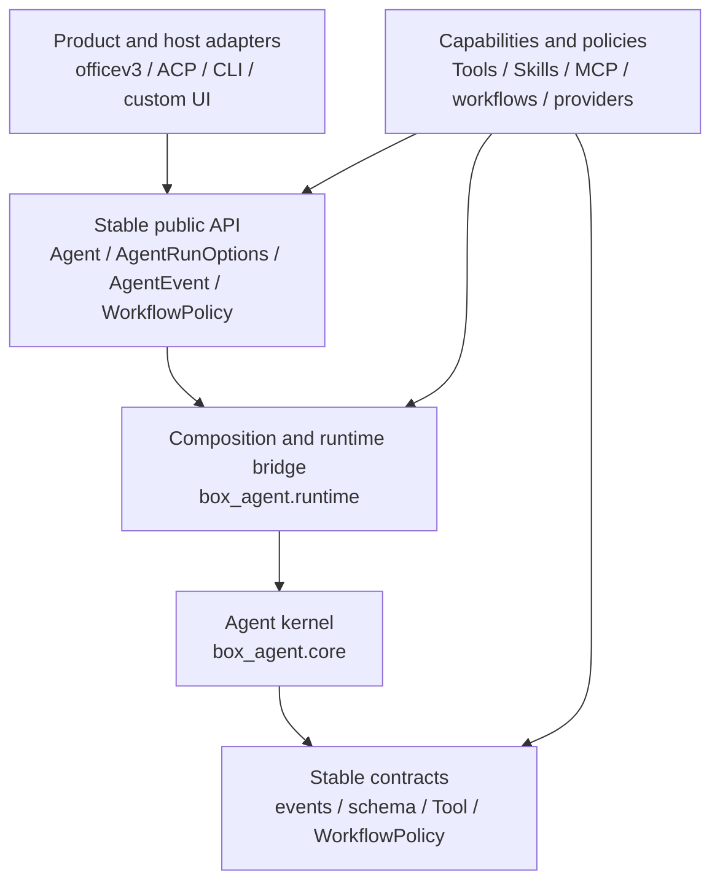

# Box-Agent Layered Architecture

## Decision

Box-Agent uses three collaboration layers. The core is **changeable**, but it
is a low-churn, core-team-owned kernel. Product and capability work should
normally be completed without editing `box_agent/core.py`.



Dependencies point downward. The kernel must not import ACP, CLI, officev3, or
another product adapter. Application and capability modules must not import
`box_agent.core` directly.

## Layers and ownership

| Layer | Main code | Typical changes | Default owner | Change rate |
| --- | --- | --- | --- | --- |
| Product / integration | `box_agent/acp/`, `box_agent/cli.py`, host code | Protocol translation, UI/session behavior, rendering | Product teams | High |
| Capability / policy | `box_agent/tools/` except `base.py`, `box_agent/skills/`, `box_agent/workflows/`, provider implementations in `box_agent/llm/`, `memory.py` | Tools, skills, providers, storage, product-neutral workflows | Feature/platform teams | Medium to high |
| Stable API / kernel | `agent.py` public API, `runtime.py`, `core.py`, `workflow_policy.py`, `events.py`, `schema.py`, `loop_guards.py`, `hooks.py`, `artifacts.py`, `turn_policy.py`, `tools/base.py` | Loop invariants, shared contracts, composition, scheduling, cancellation, security enforcement points | Core team | Low |

“Core-owned” means a core maintainer reviews and approves the change. It does
not mean the files can never change.

## Public entry points

Application adapters run a turn through `Agent.run_events()`. They configure
host-specific collaborators with a complete `AgentRunOptions` snapshot:

```python
from dataclasses import replace

from box_agent import Agent

options = replace(
    agent.default_run_options(),
    session_id=host_session_id,
    permission_negotiator=permission_adapter,
    hooks=host_hooks,
)

async for event in agent.run_events(options=options):
    await render_for_host(event)
```

Use the public `Agent` configuration methods instead of assigning its private
fields:

- `set_permission_negotiator(...)`
- `set_memory_extractor(...)`
- `set_memory_proposal_negotiator(...)`
- `clear_history()`

Framework capabilities that intentionally create an isolated low-level loop,
such as `SubAgentTool`, may import `run_agent_loop` from
`box_agent.runtime`. `box_agent.runtime` is the only production-code bridge
allowed to import the implementation module `box_agent.core`.

Shared artifact helpers are in `box_agent.artifacts`; turn classification is
in `box_agent.turn_policy`. Neither requires importing the kernel.

Stateful, product-neutral workflows implement the public `WorkflowPolicy`
contract. Built-in policies are selected in `box_agent.workflows` and composed
by `box_agent.runtime`; `box_agent.core` receives only the contract. A host may
inject a custom implementation with `AgentRunOptions.workflow_policy` without
editing the kernel.
`CompletionGate.workflow_options` is opaque to the kernel, while
`WorkflowPolicy.build_checkpoint()` lets a workflow re-derive its own stage
from persisted artifacts.

Application adapters may retain an opaque `CompletionGate` across protocol
turns. They use the generic `box_agent.workflows.recover_completion_gate()`
registry after a host restart; they must not inspect a concrete workflow kind
or its checkpoint files.

The controlled-presentation boundary is split further:

| Module | Responsibility |
| --- | --- |
| `completion.py`, `delivery.py` | Generic deliverable intent, pending-gate lifecycle signals, and workflow-router composition |
| `workflows/presentation_routing.py` | PPT-specific recognition, research mode, and Completion Gate options |
| `workflows/presentation_checkpoint.py` | Filesystem-derived PPT stages and next actions |
| `workflows/controlled_presentation.py` | PPT tool restrictions, evidence rules, and per-run state |
| `workflows/presentation_recovery.py` | Rebuild an interrupted PPT gate from durable artifacts |

Changing PPT recognition, stages, or tool rules therefore does not require
editing `core.py` or `loop_guards.py`.

### CompletionGate migration

The workflow-specific constructor argument was intentionally removed from the
generic gate. Callers that previously constructed:

```python
CompletionGate(
    workflow_checkpoint_kind="controlled_presentation",
    presentation_research_mode="deep",
)
```

must migrate to:

```python
CompletionGate(
    workflow_checkpoint_kind="controlled_presentation",
    workflow_options={"research_mode": "deep"},
)
```

`presentation_research_mode` is no longer accepted and raises `TypeError`.
There is no compatibility alias in the kernel because that would reintroduce
a PPT-specific contract into `loop_guards.py`.

## Where a change belongs

| Requirement | Put it here |
| --- | --- |
| Add a tool or external ability | A `Tool` implementation, Skill, or MCP server |
| Add a model provider or wire quirk | `box_agent/llm/` |
| Change ACP fields, session metadata, or host rendering | `box_agent/acp/` |
| Change terminal commands or display | `box_agent/cli.py` |
| Add a reusable business workflow | `box_agent/workflows/` implementing `WorkflowPolicy`, or a Skill |
| Change automatic deliverable recognition or routing | `completion.py`, `delivery.py`, or the matching `workflows/*_routing.py` |
| Add a new host-neutral event | `events.py`, with core-team review |
| Change scheduling, cancellation, tool-call closure, or security invariants | Kernel, with core-team review |

If a product feature appears to require a Core edit, first ask whether it can
be expressed as a tool, hook, event consumer, run option, completion gate, or
Skill. If none is sufficient, add the smallest generic contract to Core; do not
embed a product name or one workflow's state machine in the kernel.

## Core change gate

A Core change should include:

1. The invariant or missing generic contract that requires the change.
2. Compatibility impact on `AgentRunOptions`, events, tools, CLI, and ACP.
3. Focused regression tests plus the full suite.
4. Packaged-runtime rebuild/install/probe status when officev3 consumes it.
5. A core-maintainer approval.

Event and option changes should be additive when possible. Removing or
reinterpreting an existing field requires an explicit migration.

## Automated boundary

`tests/test_architecture_boundaries.py` rejects production modules that import
`box_agent.core` outside `box_agent/runtime.py`, rejects Core dependencies on
application adapters, rejects concrete workflow imports or workflow-name
branches in Core, and rejects PPT-specific state or vocabulary in `core.py`,
`loop_guards.py`, and `workflow_policy.py`. It also rejects concrete
presentation-workflow imports or kind checks in ACP. This test protects
dependency direction; ownership approval still belongs in repository
governance.

For enforced ownership, configure a real GitHub core-maintainer user/team in
`CODEOWNERS`, require code-owner review for the protected branch, and require
the boundary/full test jobs. Do not add a placeholder team: an invalid owner
silently weakens the rule.

## Current transition debt

The dependency boundary is now explicit. Controlled-presentation routing,
filesystem checkpoints, recovery, policy state, and tool restrictions live in
the capability/workflow layer. ACP retains only an opaque gate between
protocol turns, and the stable kernel consumes only generic contracts.
Remaining incremental work:

- `agent.py` still combines the public facade with terminal rendering and some
  goal/session conveniences.
- GitHub ownership enforcement needs the repository's real maintainer handle
  and branch-rule configuration.

Move these incrementally with behavior-preserving tests. Do not rewrite the
kernel in one migration.
