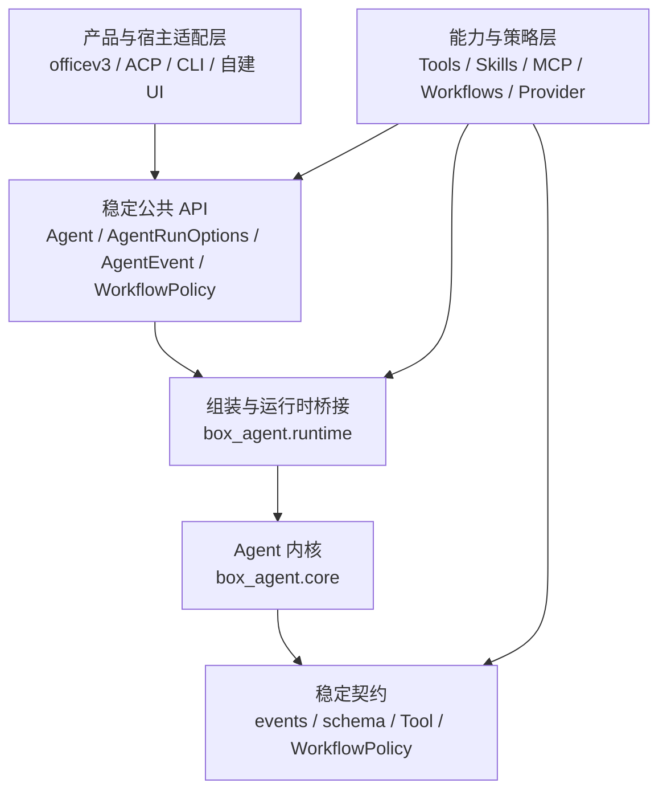

# Box-Agent 分层架构

## 架构决定

Box-Agent 采用三层协作结构。Core **不是不能改**，而是由核心团队维护、低频
变化的内核。产品与能力开发通常不应修改 `box_agent/core.py`。



依赖只能向下。内核不能依赖 ACP、CLI、officev3 或其他产品适配器；产品层与
能力层也不能直接导入 `box_agent.core`。

## 层级与所有权

| 层级 | 主要代码 | 常见改动 | 默认维护者 | 变化频率 |
| --- | --- | --- | --- | --- |
| 产品 / 接入层 | `box_agent/acp/`、`box_agent/cli.py`、宿主代码 | 协议转换、UI/会话行为、渲染 | 产品团队 | 高 |
| 能力 / 策略层 | `box_agent/tools/`（除 `base.py`）、`box_agent/skills/`、`box_agent/workflows/`、`box_agent/llm/` 中的 Provider 实现、`memory.py` | 工具、Skill、Provider、存储、与产品无关的工作流 | 业务/平台团队 | 中到高 |
| 稳定 API / 内核层 | `agent.py` 公共 API、`runtime.py`、`core.py`、`workflow_policy.py`、`events.py`、`schema.py`、`loop_guards.py`、`hooks.py`、`artifacts.py`、`turn_policy.py`、`tools/base.py` | 循环不变量、共享契约、组装、调度、取消、安全执行点 | 核心团队 | 低 |

“核心团队维护”表示修改必须由核心维护者评审和批准，不表示这些文件永远
不能改。

## 公共接入方式

产品适配器通过 `Agent.run_events()` 执行一轮，并用完整的
`AgentRunOptions` 快照覆盖宿主相关服务：

```python
from dataclasses import replace

from box_agent import Agent

options = replace(
    agent.default_run_options(),
    session_id=host_session_id,
    permission_negotiator=permission_adapter,
    hooks=host_hooks,
)

async for event in agent.run_events(options=options):
    await render_for_host(event)
```

配置 `Agent` 时使用公共方法，不直接写私有字段：

- `set_permission_negotiator(...)`
- `set_memory_extractor(...)`
- `set_memory_proposal_negotiator(...)`
- `clear_history()`

确实需要独立低层循环的框架能力（例如 `SubAgentTool`），可以从
`box_agent.runtime` 导入 `run_agent_loop`。生产代码中只有
`box_agent.runtime` 可以导入实现模块 `box_agent.core`。

产物目录、命名与元数据公共逻辑位于 `box_agent.artifacts`；轮次文本判断位于
`box_agent.turn_policy`。上层使用它们不需要依赖内核。

有状态、与产品无关的工作流实现公共 `WorkflowPolicy` 契约。内置策略在
`box_agent.workflows` 中选择，由 `box_agent.runtime` 完成组装；
`box_agent.core` 只接收契约，不认识具体工作流。宿主也可以通过
`AgentRunOptions.workflow_policy` 注入自定义实现，而不修改内核。
`CompletionGate.workflow_options` 对内核是不透明配置；工作流通过
`WorkflowPolicy.build_checkpoint()` 从持久化产物重新推导自身阶段。

产品适配器可以跨协议轮次保存一个不透明的 `CompletionGate`。宿主重启后，
适配器通过通用的 `box_agent.workflows.recover_completion_gate()` 注册入口
请求恢复，不能检查具体工作流名称或其 checkpoint 文件。

受控 PPT 的边界进一步拆分为：

| 模块 | 责任 |
| --- | --- |
| `completion.py`、`delivery.py` | 通用交付意图、pending gate 生命周期信号与工作流路由组装 |
| `workflows/presentation_routing.py` | PPT 专用识别、研究模式和 Completion Gate 参数 |
| `workflows/presentation_checkpoint.py` | 从文件系统产物推导 PPT 阶段与下一动作 |
| `workflows/controlled_presentation.py` | PPT 工具限制、证据约束和每轮有状态策略 |
| `workflows/presentation_recovery.py` | 从持久化产物重建中断的 PPT gate |

因此修改 PPT 识别、阶段或工具规则，不需要修改 `core.py` 或
`loop_guards.py`。

### CompletionGate 迁移说明

通用 Gate 已移除工作流专用构造参数。旧写法：

```python
CompletionGate(
    workflow_checkpoint_kind="controlled_presentation",
    presentation_research_mode="deep",
)
```

必须迁移为：

```python
CompletionGate(
    workflow_checkpoint_kind="controlled_presentation",
    workflow_options={"research_mode": "deep"},
)
```

`presentation_research_mode` 已不再接受，继续传入会触发 `TypeError`。内核没有
保留兼容别名，因为这会把 PPT 专用契约重新引入 `loop_guards.py`。

## 一个需求应该放在哪里

| 需求 | 放置位置 |
| --- | --- |
| 新增工具或外部能力 | `Tool` 实现、Skill 或 MCP Server |
| 新增模型 Provider 或协议兼容 | `box_agent/llm/` |
| 修改 ACP 字段、会话元数据或宿主渲染 | `box_agent/acp/` |
| 修改终端命令或显示 | `box_agent/cli.py` |
| 新增可复用业务工作流 | 在 `box_agent/workflows/` 实现 `WorkflowPolicy`，或使用 Skill |
| 修改自动交付物识别或路由 | `completion.py`、`delivery.py` 或对应 `workflows/*_routing.py` |
| 新增与宿主无关的事件 | `events.py`，需要核心团队评审 |
| 修改调度、取消、工具调用闭合或安全不变量 | 内核，需要核心团队评审 |

如果产品功能看起来必须修改 Core，先判断能否通过 Tool、Hook、事件消费者、
Run Option、Completion Gate 或 Skill 完成。都不满足时，才在 Core 中增加
最小、通用的契约；不要把产品名或某一个业务工作流的状态机写进内核。

## Core 修改门槛

修改 Core 时应提供：

1. 必须修改的内核不变量，或缺失的通用契约。
2. 对 `AgentRunOptions`、事件、工具、CLI、ACP 的兼容性说明。
3. 针对性回归测试和完整测试。
4. officev3 使用该路径时，说明是否完成运行时重打包、安装和探测。
5. 核心维护者批准。

事件和 Option 尽量只做增量扩展。删除字段或改变既有语义必须提供明确迁移
方案。

## 自动边界

`tests/test_architecture_boundaries.py` 会拒绝三类回退：

- 除 `box_agent/runtime.py` 外的生产模块直接导入 `box_agent.core`；
- Core 反向依赖 ACP、CLI 等产品适配器。
- Core 导入具体工作流实现，或按具体工作流名称分支；
- `core.py`、`loop_guards.py`、`workflow_policy.py` 出现 PPT 专用状态或术语。
- ACP 导入具体演示工作流模块，或判断具体工作流名称。

测试能保护依赖方向，但不能代替代码所有权。要做到“只有我和我的团队能批准
Core 修改”，还需要把真实 GitHub 用户或团队写入 `CODEOWNERS`，在受保护分支
启用 Code Owner Review，并要求边界测试与完整测试通过。不要填写虚构团队；
无效 Owner 会让规则看似存在、实际失效。

## 当前过渡债务

现在依赖边界已经明确。受控 PPT 的自动路由、文件系统 checkpoint、恢复、
策略状态和工具限制均位于能力/工作流层；ACP 跨协议轮次只保存不透明 gate，
稳定内核只消费通用契约。仍需逐步处理：

- `agent.py` 仍同时包含公共 Facade、终端渲染以及部分 Goal/会话便利逻辑。
- GitHub 所有权强制规则仍需仓库真实维护者 Handle 与分支规则。

这些内容应在回归测试保护下逐步迁移，不建议一次性重写内核。
