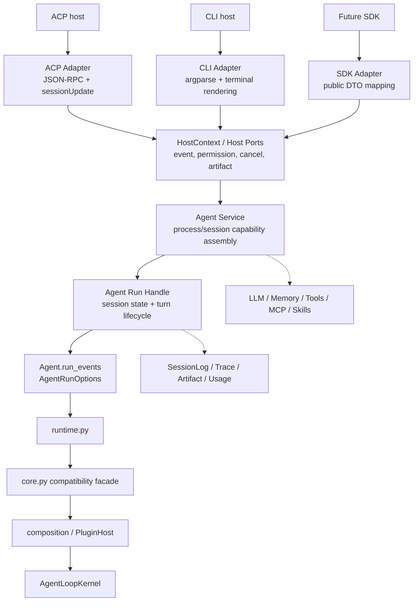

# Box-Agent Thin ACP/CLI 与 Agent Runtime 渐进重构设计

## 1. 文档状态

- 状态：首轮渐进迁移已完成；2026-09-08 已与 `origin/main` 的
  `56ee390` 对齐。本文的完整目标架构仍是后续迁移方向，不代表兼容门面
  和所有宿主装配逻辑已经可以删除。
- 设计基线：`666ef864ab2e1786aa254bfe22bc0b5a6f44583f`。
- 范围：`box_agent/acp/`、`box_agent/cli.py`、`box_agent/core.py` 及为消除
  三者重复而新增的宿主无关 runtime/session 模块。
- 目标：保持外部协议、公共 Python API、事件、提示、状态和运行时行为不变，
  逐步把 ACP/CLI 中重复的装配与通用会话控制收敛到 Agent Runtime。
- 实施原则：先增加测试和委托路径，后删除已经被证明等价的重复代码；每个阶段
  独立验证、独立审查、可以单独回退。
- 当前进度：LLM/Permission/Memory/Agent 公共构造、Goal 预算/无进展纯函数、project
  context/env context 中立化、Skill preload/cache projection、prompt segment spacing、
  Goal autopilot controller、MCP registry controller、usage/trace/artifact/cleanup
  observer、Run Handle 的首个兼容别名切片以及 Agent Service 的窄构造门面已完成；
  完整 capability assembly 仍按宿主差异保留在 ACP/CLI，后续只做有回归覆盖的窄切片。
- 当前 Run Handle 代理原 `SessionState`，保持单一状态引用；本轮没有把全部
  状态字段迁入新的 owner，也没有删除 ACP 会话或 CLI 交互兼容入口。

## 2. 背景

Kernel/Plugin Host 重构已经把模型—工具循环、事件顺序、停止原因和 Kernel Ports
收敛到 `box_agent/kernel/`、`box_agent/composition.py` 和稳定 runtime 桥接中。
本设计不再次调整这些内核职责。

当前 CLI 与 ACP 都通过 `Agent` 进入同一个 runtime/kernel，但宿主入口仍分别承担
大量相似工作：

- LLM、Memory、Tool、Permission 和 Agent 的创建；
- system prompt 与宿主上下文的拼装；
- Skill 筛选、预加载和 cache fingerprint；
- MCP ready/auth refresh/tool registration；
- Goal autopilot 的预算、续跑和无进展判断；
- session/run 状态、usage、trace、artifact 和清理；
- 宿主特异的终端或 ACP 事件渲染。

这些职责混在大函数中，使相同策略可能在两个入口漂移，也使合法的宿主差异与意外
重复难以区分。

## 3. 目标与非目标

### 3.1 目标

1. ACP、CLI 和未来 SDK 只负责协议/交互转换、宿主元数据和明确的宿主策略。
2. 共享的 capability 装配只有一份实现，ACP/CLI 显式传入差异参数。
3. 通用 session/turn 状态只有一个权威 owner；兼容字段可以暂时代理该状态。
4. Goal、Skill、MCP 和普通 turn 生命周期通过同一条 Agent Runtime 路径执行。
5. 保持 `Agent.run_events()`、`Agent.run()`、`runtime.run_agent_loop()` 和
   `core.run_agent_loop()` 的公共签名及默认行为。
6. 保持相同输入下的 LLM 请求、工具集合、消息历史、事件序列、停止原因、
   Session Log、Trace、Artifact 和用户可见输出。
7. 每个迁移阶段都有变更前细节清单、直接回归测试和变更后差异核对。

### 3.2 非目标

1. 不修改 `AgentLoopKernel`、Kernel Engines、Kernel Ports 或 Plugin Host 语义。
2. 不顺便修改 prompt 文案、默认配置、权限含义、MCP 时序或 Skill 匹配规则。
3. 不删除 `core.py` 的兼容导出、旧 helper 路径或 monkeypatch 可见行为。
4. 不一次性删除 ACP `SessionState`、`_run_turn` 或 `Agent.run()`。
5. 不在本轮实现 SDK；只保证未来 SDK 可以使用相同 Host Ports 与 Agent Runtime。
6. 不引入动态插件发现、运行时热替换、feature flag 双实现或新的配置表面。
7. 不借重构进行无关重命名、格式化、性能优化或错误文案调整。

## 4. 目标架构与职责



### 4.1 Adapter

Adapter 只保留宿主不可共享的行为。

ACP Adapter 保留：

- stdio/JSON-RPC 生命周期及 stdout/stderr 边界；
- `initialize`、`newSession`、`prompt`、`cancel`、`extMethod`；
- ACP session/task/title/client metadata 与 attachment 解析；
- reverse `requestPermission` 和其他 reverse RPC；
- AgentEvent 到 `sessionUpdate`、raw output 和 ACP stop reason 的映射；
- deferred MCP/Skill 状态向宿主报告；
- ACP utility session、model binding 和 filesystem policy 输入。

CLI Adapter 保留：

- argparse、setup、doctor、install、log、trace 等命令；
- API probe、setup wizard、retry 终端提示；
- prompt_toolkit、Esc 取消、slash command 和交互循环；
- CLI 权限确认与 memory proposal UI；
- 终端 renderer、JSON summary 和用户可见 warning；
- task 模式和 interactive 模式的明确选择。

Adapter 可以装配 Host Ports，但不得重新实现共享 capability 构造、Goal 续跑算法、
Skill prompt 算法或 MCP tool reconciliation。

### 4.2 Agent Service

Agent Service 是进程/会话创建边界，不包含 ACP 或 CLI 类型。它负责调用现有底层
能力实现并返回构造完成的 session/runtime 组件：

- 从 `Config` 创建 LLM client，并接受可选 retry callback；
- 创建 Memory manager/extractor/maintainer，并由调用方选择启动时序；
- 调用现有 `initialize_base_tools()` 与 `add_workspace_tools()`；
- 创建 GrantStore、CapabilityPolicy、PermissionEngine；
- 拼装共享 prompt segments，再应用宿主 overlay；
- 创建 `Agent`，原样传递现有构造参数（通过可注入 factory 保留旧测试/宿主挂点）；
- 持有或接收 MCP、Skill 和 PluginHost 需要的共享 capability。

第一阶段不直接创建一个包含所有分支的大型 builder。先建立独立、可测试、无协议
依赖的叶子 helper；只有当这些 helper 在两个宿主中验证等价后，才用窄的
`AgentService` 门面组合它们。

### 4.3 Agent Run Handle

Run Handle 是 session/turn 级门面，不包含 ACP wire 类型或终端颜色。它负责：

- 消息、取消 token、inject queue 与活动 run 的单一状态引用；
- Goal mutation、autopilot continuation budget 和 no-progress 判断；
- Skill turn filter/preload/cache fingerprint 计算；
- MCP readiness/auth refresh/tool reconciliation 的通用操作；
- `AgentRunOptions` 快照和 `Agent.run_events()` 调用；
- 通用 usage/trace/artifact/cleanup observer；
- 返回结构化 RunResult/AgentEvent，不直接渲染给宿主。

迁移期保留 ACP `SessionState` 与 `_run_turn`。它们先委托 Run Handle，并通过属性或
相同对象引用暴露旧字段。只有测试证明不再存在第二状态 owner 后，才删除重复字段。

### 4.4 Core 与 Kernel

`core.py` 继续作为兼容门面，保留旧签名、默认值、helper re-export 和 timing
monkeypatch 行为。新产品代码只通过 `Agent` 或 `runtime.py` 进入执行路径。

`AgentLoopKernel` 继续唯一拥有模型—工具状态机、事件顺序、预算、取消闭合、
上下文压缩和 StopReason。ACP/CLI 的 host metadata、rendering 和交互策略不得进入
Kernel。

## 5. 细节保留账本

每个阶段开始前，实施者必须把受影响条目的现有函数、默认值、分支、日志/事件和测试
记录到该阶段的测试或审查清单中。以下账本是最低集合，不可用“保持原行为”一句话
替代。

| 领域 | 必须保留的细节 | 允许共享的部分 |
| --- | --- | --- |
| LLM | CLI probe/setup/retry callback；ACP fast startup、session model binding | Config 到 client kwargs 的映射和 client 创建 |
| Memory | CLI import 顺序；ACP 后台启动；每 session extractor；失败日志 | manager/extractor/maintainer 的构造 |
| Tools | base/workspace tool 名称、顺序、defer gate、GetSkillTool 行为 | 现有 setup helper 的参数装配 |
| Permission | CLI stdin UI；ACP reverse RPC、timeout、coalescing、permission mode | policy/engine/grant 构造和纯 grant bookkeeping |
| Prompt | 片段顺序、fallback 文案、path/layout/env/memory/expert 内容 | 宿主无关片段 builder |
| Goal | CLI slash command/sidecar；ACP `_meta`；SessionLog 记录 | mutation API、autopilot budget/no-progress 算法 |
| Skill | host-selected/expert 输入、warning、attribution、cache 字段 | filter/preload/prompt/hash 计算 |
| MCP | CLI blocking；ACP deferred update；auth 后 tool register | await/refresh/reconcile 原子操作 |
| State | ACP 测试可见字段、cancel/inject 行为、turn/error metadata | Agent/Run Handle 中的权威通用状态 |
| Events | 完整事件顺序、字段、StopReason、raw output、terminal output | 通用 observer 与 RunResult |
| Core | public/legacy imports、默认值、monkeypatch timing | 仅内部委托关系和文档边界 |

## 6. 渐进迁移阶段

### 阶段 0：建立行为基线

- 为 CLI/ACP 当前 capability 装配结果建立可比较的测试夹具。
- 记录相同 fake LLM/tool 输入下的 AgentEvent 顺序、StopReason、消息历史和工具名。
- 记录 ACP `SessionState`、`_run_turn` 以及 core compatibility 的直接测试依赖。
- 不修改生产行为。

### 阶段 1：共享无副作用叶子 helper

- 提取 LLM client 参数映射/创建 helper。
- 提取 Permission policy/engine/grant 纯装配 helper。
- 把协议无关的 project/env context builder 移到中立模块，并从原 ACP 路径重导出。
- 提取 prompt segment composer，保持两个宿主的片段顺序和 fallback 文案。
- 原 CLI/ACP helper 名称保留并委托共享实现。

每完成一个 helper，单独执行 RED/GREEN 回归，不在同一步修改下一个领域。

### 阶段 2：共享 capability/session 创建

- 使用阶段 1 的 helper 建立窄的 `AgentService`。
- 收敛 Memory、base/workspace tools 和 Agent constructor 参数装配。
- CLI/ACP 显式传入合法差异，不使用 `mode="cli|acp"` 隐藏大型分支。
- 旧入口继续存在，只把内部创建动作委托给 Agent Service。

### 阶段 3：共享 turn preparation

- 提取 Skill filter/preload/cache fingerprint 的纯计算。
- 提取 MCP await/refresh/reconcile 原子操作；blocking/deferred 由 Adapter 决定。
- 提取 Goal autopilot continuation/no-progress controller；所有 mutation 继续调用
  现有 Agent Goal API。
- CLI goal sidecar 保留兼容读写，本阶段不迁移或删除历史状态。

### 阶段 4：引入 Run Handle 并统一状态引用

- Run Handle 负责 AgentRunOptions、取消、inject queue 和通用 turn lifecycle。
- ACP `SessionState` 保留结构，对通用字段使用同一对象或兼容属性代理。
- `_run_turn` 保留方法名和可 monkeypatch 性，只委托 Run Handle 并渲染 ACP 事件。
- 每迁移一个字段，都增加“单一 owner”测试后再移除第二份写入。

### 阶段 5：提取通用 observer/cleanup

- 从 ACP `_run_turn` 提取 usage、trace、artifact 和通用资源清理。
- ACP wire mapping、task metadata 和 reverse RPC 保留在 ACP。
- 保留现有错误传播、日志等级、事件顺序和 cleanup 时机。

### 阶段 6：整理 CLI renderer 与兼容层

- CLI 改为显式消费 `run_events()` 并调用 CLI renderer。
- `Agent.run()` 继续保留默认终端行为，作为公共兼容接口。
- `core.py` 不删除兼容导出；只确认 ACP/CLI 没有新增对 core/kernel/composition
  的直接依赖。
- 只有确认重复代码没有独立调用方、测试和文档依赖后，才删除对应旧实现体。

## 7. 每阶段删除门槛

任何原代码或字段只有同时满足以下条件才能删除：

1. 已列出原位置、调用方、默认值、分支和可观察副作用。
2. 已存在针对共享实现的直接测试，并在实现前观察到预期 RED。
3. 原入口已改成委托 wrapper，focused tests 与宿主 parity tests 均为 GREEN。
4. `rg` 已确认没有未迁移的生产调用方、测试 monkeypatch、文档示例或配置引用。
5. 新旧路径在同一 fake LLM/tool fixture 下产生相同事件、StopReason 和状态写入。
6. `git diff` 已逐块检查，没有无关格式化、文案、默认值或错误处理变化。
7. 删除动作与替代实现不在同一个不可审查的大 patch 中；删除可以单独回退。

若任一条件不满足，保留旧符号为委托 wrapper 或属性代理，不进行删除。

## 8. 测试与验证

阶段性 focused tests 至少包括：

```text
tests/test_acp.py
tests/test_cli_runtime.py
tests/test_architecture_boundaries.py
tests/test_core.py
tests/test_kernel_compatibility.py
tests/test_llm_activity.py
```

新增测试按行为划分：

1. 相同配置经 CLI/ACP adapter 输入后，共享 helper 产生相同的公共构造参数。
2. 合法宿主差异仍存在，例如 retry callback、deferred MCP 和 permission mode。
3. 相同 fake LLM/tool 序列产生相同的 AgentEvent 类型/顺序与 StopReason。
4. Goal mutation/autopilot 只写一次规范状态，CLI sidecar 兼容路径单独验证。
5. cancel token、inject queue、active skills 和 goal 各自只有一个权威 owner。
6. ACP `_run_turn`、`SessionState` 与 `Agent.run()` 的兼容调用继续有效。
7. AST 边界测试阻止 ACP/CLI 直接导入 Kernel、composition 或新增 core 依赖。

每阶段验证顺序：单测 RED → 最小实现 → focused GREEN → 相关模块套件 →
`git diff --check` → 人工逐块检查 diff。只有最后阶段或 blast radius 要求时才运行
全量测试。

## 9. 风险与控制

- **提示漂移**：先逐段断言现有 prompt，再共享 builder；不在重构中统一文案。
- **初始化时序变化**：把 eager/deferred 作为显式 callback/strategy 输入，不用隐藏
  mode 分支改变执行时机。
- **状态双写**：先共享对象引用，再移除写入；不同时迁移 persistence backend。
- **测试依赖内部符号**：旧方法/字段保留 wrapper/alias，直到调用方完成迁移。
- **core 兼容破坏**：保留所有已有导出和 wrapper timing，并运行 compatibility tests。
- **大 patch 难审查**：一个阶段拆成多个独立 RED/GREEN 单元，每次只处理一个 concern。
- **打包运行时误判**：源码测试、build、install、probe、host restart 和 fresh live task
  分开报告，不以源码测试代替宿主验证。

## 10. 完成定义

重构完成需要同时满足：

- ACP/CLI 不再直接重复创建共享 LLM、Memory、Tool、Permission、Prompt 和 Agent
  capability；
- Goal、Skill、MCP 与 turn lifecycle 的通用算法只有一份实现；
- Adapter 中只剩协议/交互转换、Host Ports 装配和显式宿主策略；
- Agent Run Handle 是通用 session/run 状态的唯一 owner；
- 旧公共 API、ACP wire 行为、CLI 输出和 core compatibility tests 保持；
- Kernel/Plugin Host 没有因本重构增加 ACP/CLI 产品逻辑；
- 所有删除均满足第 7 节门槛，并能从版本差异中指向明确的替代实现。
